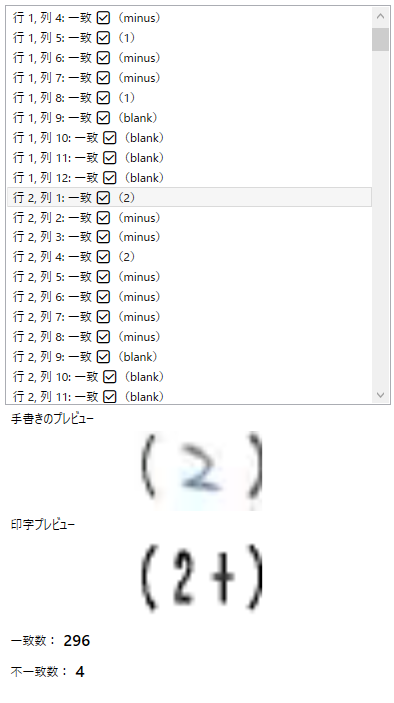

# 文字認識一致判定アプリ
本システムは、手書き文字と印字文字をそれぞれ画像分類し、ONNXモデルで比較・一致判定するアプリケーションです。

## 手書き記号分類モデル
### 概要
- PyTorchで学習して、学習済みモデルはONNX形式でエクスポート
- クラスラベルは`labels.txt`に保存
- CNNベースの画像分類
- 入力画像はグレースケールでリサイズ

### 環境
- Python 3.8+
- PyTorch
- torchvision

### 学習の実行
`python train_to_onnx.py`で以下を実行します。
- `training_data/`内の画像データを読み込み
- CNNモデルを30エポックで学習
- `model.onnx`と`labels.txt`をエクスポート

### 出力ファイル
- `model.onnx`：ONNX形式で出力された学習済みモデル
- `labels.txt`：クラスラベル一覧(1,2,3,-,N)

## 手書き・印字　比較アプリ（WPF）
### 概要
- 手書き画像と印字画像を選択して読み込み
- セル単位（25行 × 12列）で画像を分割
- ONNXモデルを使って両者を分類し、一致・不一致を判定
- プレビューやカウント表示に対応

### 使用モデル
| ファイル名   | 説明               |
|-------------|--------------------|
| `model.onnx` | 手書き分類モデル   |
| `labels.txt` | 手書きモデル用ラベル |
| `model_print.onnx` | 印字分類モデル |
| `labels_print.txt` | 印字モデル用ラベル |

### アプリの使用方法
1. 手書き画像選択
2. 印字画像選択
3. 比較実行：25行×12列のセルごとに分類して一致判定
4. 一致・不一致一覧と、プレビュー画像が表示
- 出力情報
  - 一致・不一致の件数
  - セルごとの分類結果
  - 手書き・印字それぞれのセル画像のプレビュー 

